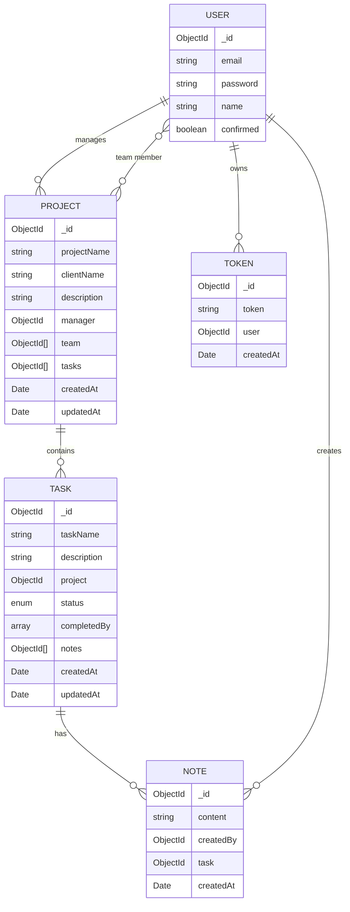

<p align="center">
  
  
  
  
</p>

<h1 align="center">🧑‍💻 DevBoard</h1>

<p align="center">
  <strong>A full-stack project &amp; task management platform built for development teams.</strong><br/>
  Create projects, organize tasks through a Kanban-style board with drag &amp; drop, collaborate with team members, and track every change — all behind a secure JWT-based authentication system.
</p>

---

## ✨ Features

### 🔐 Authentication & Security
- User registration with **email verification** (6-digit token via Nodemailer)
- Login with **JWT-based authentication** (Bearer token stored in localStorage)
- Password hashing with **bcrypt** (salt rounds: 10)
- Forgot password flow with **email reset token** (auto-expires in 10 minutes)
- Confirmation code re-request for unverified accounts
- Protected routes — all project/task endpoints require authentication
- **Axios interceptors** automatically attach JWT to every request

### 📁 Project Management
- Full **CRUD** for projects (Create, Read, Update, Delete)
- Each project has a **Manager** (owner) and optional **Team** (collaborators)
- Authorization middleware — only the manager can edit/delete the project
- Cascading delete — removing a project deletes all its tasks and notes
- Dashboard with role badges (**Manager** / **Collaborator**)

### ✅ Task Management
- Full **CRUD** for tasks within a project
- **5-stage Kanban workflow**: `Pending → On Hold → In Progress → Under Review → Completed`
- **Drag & Drop** to change task status (powered by `@dnd-kit/react`)
- Optimistic UI updates via **TanStack Query cache manipulation**
- Task activity log — tracks **who** changed the status and **when**
- Bidirectional relationship between projects and tasks

### 📝 Notes System
- Add **notes/comments** to any task
- Notes display the author name and creation timestamp
- Only the note author can delete their own note
- Cascade deletion — deleting a task removes all its notes

### 👥 Team Collaboration
- Search team members by **email**
- Add/remove collaborators from a project
- Collaborators can view the project and change task statuses
- Only the manager can add tasks, edit, or delete the project

### 👤 Profile Management
- Update **name** and **email** with duplicate email validation
- Change password with **current password verification**
- Password check endpoint for sensitive operations (e.g., delete project confirmation)

### 📧 Transactional Emails
- Professional **HTML email templates** for account confirmation & password reset
- Powered by **Nodemailer** with configurable SMTP transport (Mailtrap for dev)

---

## 🛠️ Tech Stack

| Layer | Technologies |
|-------|-------------|
| **Frontend** | React 19 · TypeScript · Vite 8 · Tailwind CSS 4 · TanStack Query 5 · React Hook Form · Zod 4 · React Router DOM 7 · Headless UI · Heroicons · @dnd-kit/react · Axios · React Toastify |
| **Backend** | Node.js · Express 5 · TypeScript · MongoDB · Mongoose 9 · JWT (jsonwebtoken) · bcrypt · express-validator · Nodemailer · Morgan · CORS |
| **Dev Tools** | tsx (dev runner) · ESLint · Vite Plugin React · React Compiler (Babel) |

---

## 📁 Project Structure

```
Devboard/
├── BACKEND_DevBoard_MERN/
│   └── src/
│       ├── config/                # DB connection, CORS, Nodemailer setup
│       ├── controllers/           # AuthController, ProjectController, TaskController,
│       │                          # TeamController, NoteController
│       ├── emails/                # AuthEmail service (send confirmation & reset)
│       ├── emailTemplates/        # Professional HTML email templates
│       ├── middleware/            # authMiddleware (JWT), projectMiddleware,
│       │                          # taskMiddleware, validationMiddleware
│       ├── models/                # User, Project, Task, Note, Token (Mongoose schemas)
│       ├── routes/                # authRoutes, projectRoutes (tasks, teams, notes nested)
│       ├── utils/                 # JWT generation, bcrypt helpers, token generator
│       ├── server.ts              # Express app configuration
│       └── index.ts               # Server entry point
│
├── FRONTEND_DevBoard_MERN/
│   └── src/
│       ├── api/                   # Axios API calls (Auth, Project, Task, Team, Note, Profile)
│       ├── components/
│       │   ├── auth/              # NewPasswordForm, NewPasswordToken
│       │   ├── notes/             # AddNoteForm, NoteDetail, NotesPanel
│       │   ├── projects/          # ProjectForm, EditProjectForm, DeleteModal
│       │   ├── tasks/             # TaskList, TaskCard, TaskForm, AddTaskModal,
│       │   │                      # EditTaskModal, TaskModalDetails, DropTask
│       │   └── team/              # AddMemberModal, AddMemberForm, SearchResult
│       ├── hooks/                 # useAuth (React Query-based auth hook)
│       ├── layouts/               # AppLayout, AuthLayout, ProfileLayout
│       ├── locales/               # Status translations (en)
│       ├── types/                 # Zod schemas & TypeScript types (centralized)
│       ├── utils/                 # Axios instance, date formatter, auth policies
│       ├── views/
│       │   ├── auth/              # Login, Register, ConfirmAccount, ForgotPassword,
│       │   │                      # NewPassword, RequestNewCode
│       │   ├── projects/          # CreateProject, EditProject, ProjectDetails, ProjectTeam
│       │   ├── profile/           # ProfileView, ChangePasswordView
│       │   └── 404/               # NotFound
│       ├── router.tsx             # Application routing
│       └── main.tsx               # React entry point
│
└── README.md
```

---

## ⚙️ Prerequisites

- **Node.js** ≥ 18.0.0
- **npm** ≥ 9.0.0
- **MongoDB** (local or [MongoDB Atlas](https://www.mongodb.com/atlas))
- **SMTP service** for emails (e.g., [Mailtrap](https://mailtrap.io) for development)

---

## 🚀 Getting Started

### 1. Clone the repository

```bash
git clone https://github.com/CamiloVelasquezBotero/Devboard.git
cd Devboard
```

### 2. Backend Setup

```bash
cd BACKEND_DevBoard_MERN
npm install
```

Create a `.env` file inside `BACKEND_DevBoard_MERN/`:

```env
DATABASE_URL=mongodb+srv://<user>:<password>@cluster.mongodb.net/<dbname>
FRONTEND_URL=http://localhost:5173
JWT_SECRET=your_super_secret_key

SMTP_HOST=sandbox.smtp.mailtrap.io
SMTP_PORT=2525
SMTP_USER=your_smtp_user
SMTP_PASS=your_smtp_pass
```

Start the development server:

```bash
npm run dev        # Standard mode
npm run dev:api    # API-only mode (allows requests without CORS origin check)
```

> The backend runs on **`http://localhost:4000`**

### 3. Frontend Setup

```bash
cd ../FRONTEND_DevBoard_MERN
npm install
```

Create a `.env.local` file inside `FRONTEND_DevBoard_MERN/`:

```env
VITE_API_URL=http://localhost:4000/api
```

Start the development server:

```bash
npm run dev
```

> The frontend runs on **`http://localhost:5173`**

---

## 📡 API Endpoints

### Authentication (`/api/auth`)

| Method | Endpoint | Description | Auth |
|--------|----------|-------------|------|
| `POST` | `/create-account` | Register a new user | ❌ |
| `POST` | `/confirm-account` | Confirm account with 6-digit token | ❌ |
| `POST` | `/login` | Login and receive JWT | ❌ |
| `POST` | `/request-code` | Request a new confirmation code | ❌ |
| `POST` | `/forgot-password` | Request password reset email | ❌ |
| `POST` | `/validate-token` | Validate a reset token | ❌ |
| `POST` | `/update-password/:token` | Set new password with valid token | ❌ |
| `GET` | `/user` | Get authenticated user profile | ✅ |
| `PUT` | `/profile` | Update name and email | ✅ |
| `POST` | `/update-password` | Change password (requires current) | ✅ |
| `POST` | `/check-password` | Verify current password | ✅ |

### Projects (`/api/projects`)

| Method | Endpoint | Description | Auth |
|--------|----------|-------------|------|
| `POST` | `/` | Create a new project | ✅ |
| `GET` | `/` | Get all user's projects | ✅ |
| `GET` | `/:id` | Get project by ID with tasks | ✅ |
| `PUT` | `/:projectId` | Update project (manager only) | ✅ 🔒 |
| `DELETE` | `/:projectId` | Delete project (manager only) | ✅ 🔒 |

### Tasks (`/api/projects/:projectId/tasks`)

| Method | Endpoint | Description | Auth |
|--------|----------|-------------|------|
| `POST` | `/` | Create a task (manager only) | ✅ 🔒 |
| `GET` | `/` | Get all tasks of the project | ✅ |
| `GET` | `/:taskId` | Get task details with history & notes | ✅ |
| `PUT` | `/:taskId` | Update task (manager only) | ✅ 🔒 |
| `DELETE` | `/:taskId` | Delete task (manager only) | ✅ 🔒 |
| `POST` | `/:taskId/status` | Update task status | ✅ |

### Team (`/api/projects/:projectId/team`)

| Method | Endpoint | Description | Auth |
|--------|----------|-------------|------|
| `GET` | `/` | Get project team members | ✅ |
| `POST` | `/find` | Search member by email | ✅ |
| `POST` | `/` | Add member to project | ✅ |
| `DELETE` | `/:userId` | Remove member from project | ✅ |

### Notes (`/api/projects/:projectId/tasks/:taskId/notes`)

| Method | Endpoint | Description | Auth |
|--------|----------|-------------|------|
| `POST` | `/` | Create a note on a task | ✅ |
| `GET` | `/` | Get all notes of a task | ✅ |
| `DELETE` | `/:noteId` | Delete a note (author only) | ✅ |

> ✅ = Requires JWT &nbsp;&nbsp; 🔒 = Manager authorization required

---

## 📊 Data Models



---

## 🏗️ Production Build

### Backend

```bash
cd BACKEND_DevBoard_MERN
npm run build    # Compiles TypeScript → dist/
npm start        # Runs node dist/index.js
```

### Frontend

```bash
cd FRONTEND_DevBoard_MERN
npm run build    # TypeScript check + Vite production build → dist/
npm run preview  # Preview the production build locally
```

---

## 🧩 Key Architectural Decisions

| Decision | Rationale |
|----------|-----------|
| **Zod for both validation & types** | Single source of truth — Zod schemas generate TypeScript types and validate API responses at runtime |
| **TanStack Query for server state** | Automatic caching, background refetching, and optimistic updates for a snappy UX |
| **Express `router.param()` middleware** | DRY approach — project/task existence validation runs once per route group instead of per endpoint |
| **Mongoose `pre('deleteOne')` hooks** | Cascading deletion ensures no orphaned tasks or notes remain in the database |
| **Axios interceptors** | JWT token is automatically injected into every request without manual attachment |
| **@dnd-kit/react for drag & drop** | Modern, lightweight, accessible drag & drop with optimistic cache updates |

---

## 📝 License

This project is licensed under the **MIT License**.

---

<p align="center">
  Built by <a href="https://github.com/CamiloVelasquezBotero"><strong>Camilo Velasquez Botero 💎</strong></a>
</p>
